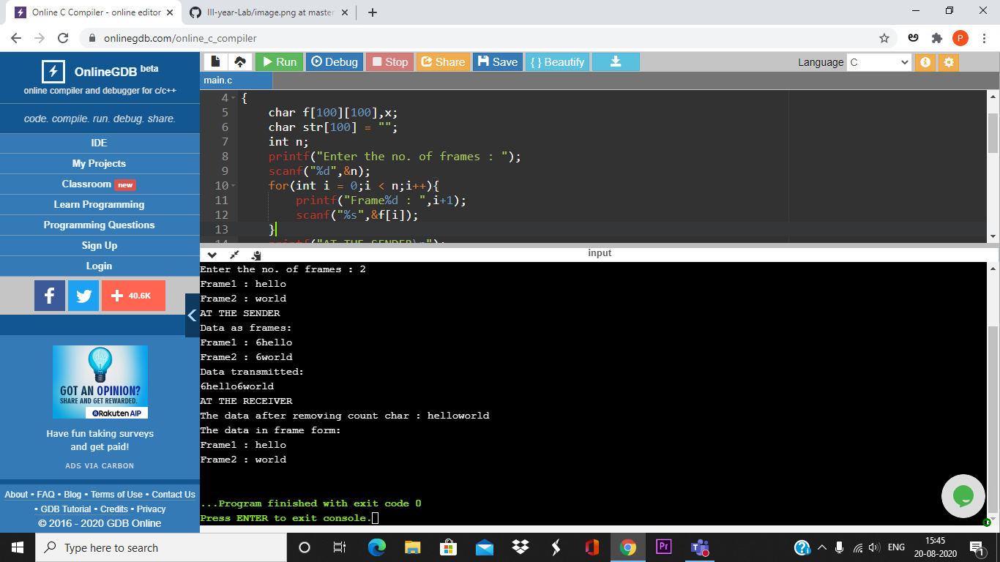

# Experiment
## Aim
To implement data link layer framing techniques such as
1.character count
2.character stuffing
3.bit stuffing

## Procedure for Character Count
1. Take the number of frames from the user.
2. Take the frames from the user.
3. Find string length of each frames.
4. Display the frames at the Sender.
5. Display the Data Transmitted.
6. Display the frames at the Receiver.

## Output
### Character Count Output

