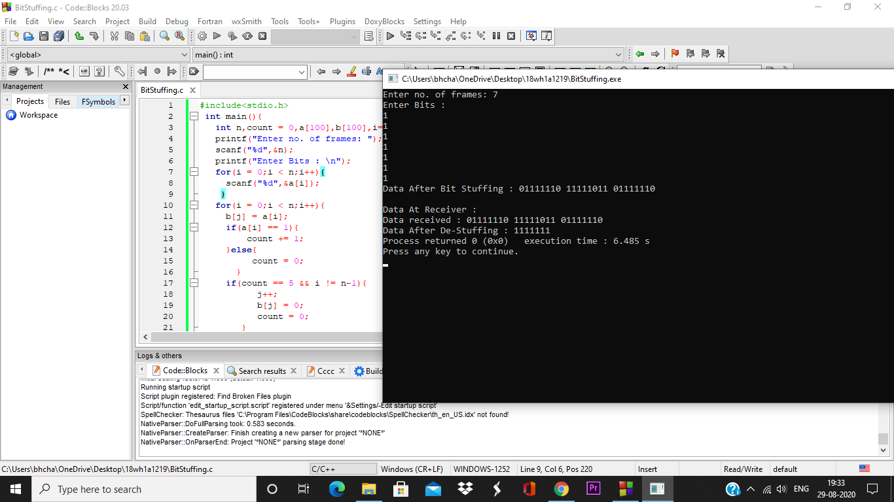

# Experiment
## Aim
To implement data link layer framing techniques such as
1.Character Count
2.Bit Stuffing
3.Character Stuffing

## Procedure for Character Count
1. Take the number of frames from the user.
2. Take the frames from the user.
3. Find string length of each frames.
4. Display the frames at the Sender.
5. Display the Data Transmitted.
6. Display the frames at the Receiver.

## Procedure for Bit Stuffing
1. Take the data from the user.
2. Insert the sequence 01111110  to signal the beginning of a frame, and the sequence 01111110 to signal the end of the frame.
3. Perform character stuffing within the frame. 
4. Add 0 after every occurrence of 11111.
5. The receiver reverses the process, removing 0 after 11111.

## Procedure for Character Stuffing
1. Take the data from the user.
2. Add the two-character sequence DLE STX (Data Link Escape, Start of Text) to indicate the beginning of a frame and the sequence DLE ETX (End of Text) to indicate the end of the frame.
3. Replace every occurrence of DLE in the user data with the two-character sequence DLE DLE.
4. The receiver reverses the process, replacing every occurrence of DLE DLE with a single DLE.

## Output
### Character Count Output

### Bit Stuffing Output

### Character Stuffing Output

