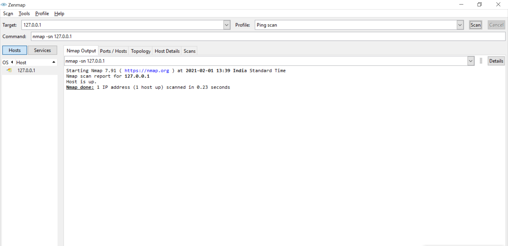
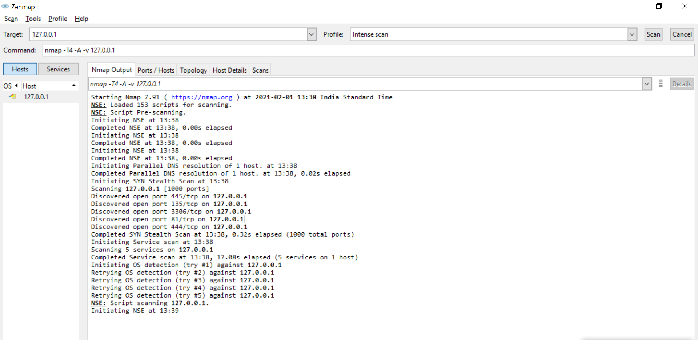

# Experiment-11
## Aim :
How to run a Nmap scan  
## Procedure :
1. Go to nmap.org link.  
2. Go to download and choose the respective operating system.  
3. Download and install Nmap  
4. After thae open Nmap and set the IP address as target value and select ping scanin profile section and click on scan.  
5. In Nmap output column we can see whether the targets are online or not.It doesnot scan any ports.  
6. And now select Intense scan in profile section.  
7. In Nmap output column we can see OS version,type of data transmitted.  
8. Thats how Nmap scan runs.  

## Output :
Ping Scan

Intense Scan

